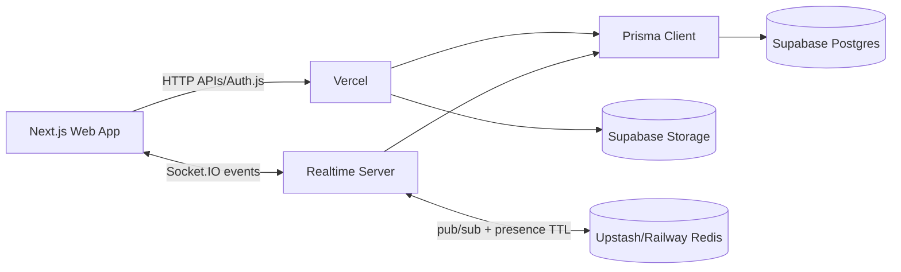
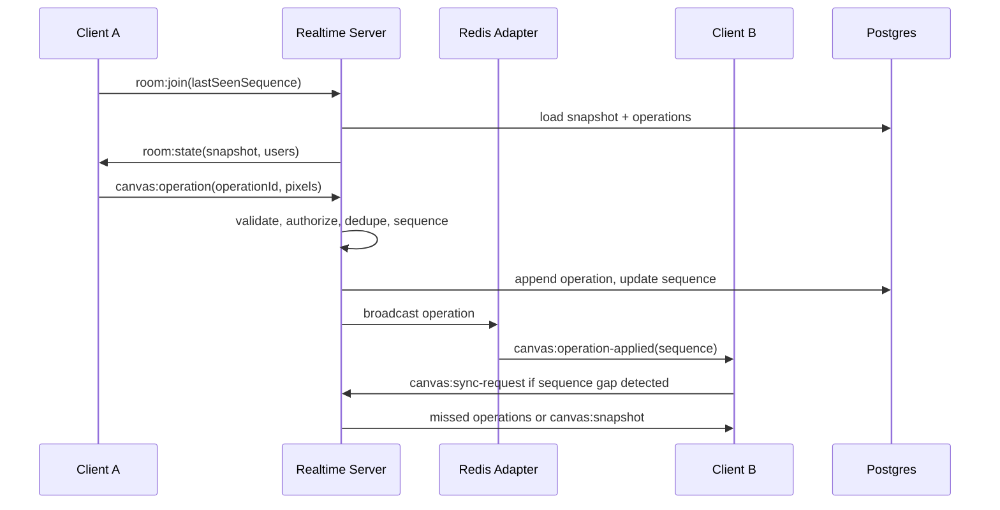

# PixelSync

PixelSync is a real-time collaborative pixel art platform for indie game developers and small creative teams. It supports authenticated workspaces, collaborative canvas editing, live cursor presence, server-ordered pixel operations, snapshot persistence, version history, invite links, and transparent PNG export.

## Screenshots

Screenshots should be captured after running the seeded demo:

- Landing page: `docs/screenshots/landing.png`
- Dashboard: `docs/screenshots/dashboard.png`
- Editor: `docs/screenshots/editor.png`
- Public canvas: `docs/screenshots/public-canvas.png`

## Features

- Next.js App Router web app with Auth.js, protected routes, dashboard, project pages, settings, invites, public viewer, and editor.
- Separate Fastify and Socket.IO realtime service with Redis adapter support.
- Shared Zod socket event contract in `@pixelsync/shared`.
- Server-authoritative operation ordering with duplicate detection and snapshot resync.
- Pixel engine based on flat `Uint32Array` RGBA data, RLE snapshots, Canvas API rendering, drawing algorithms, palette extraction, undo/redo, pan/zoom, minimap, and PNG export.
- PostgreSQL schema through Prisma for users, projects, members, canvases, snapshots, operations, versions, invites, palettes, and activity logs.
- Development demo mode with seeded users and pixel-art examples.

## Architecture



## Realtime Flow



## Monorepo

```text
apps/
  web/                 Next.js App Router application
  realtime-server/     Fastify + Socket.IO authoritative collaboration server
packages/
  shared/              Pixel engine, Zod event contracts, permission utilities
  ui/                  Reusable React UI primitives
  config/              Shared TypeScript config
prisma/                Schema, migration, seed data
docs/                  Architecture, protocol, deployment, security, testing, ADRs
tests/e2e/             Playwright workflows
```

## Local Setup

```bash
corepack enable
pnpm install
docker compose up -d
cp .env.example .env
cp apps/web/.env.example apps/web/.env.local
cp apps/realtime-server/.env.example apps/realtime-server/.env
pnpm db:generate
pnpm db:migrate
pnpm db:seed
pnpm dev
```

Open:

- Web: `http://localhost:3000`
- Realtime health: `http://localhost:4000/health`

Demo sign-in uses `demo@pixelsync.dev` when `NEXT_PUBLIC_DEMO_MODE=true`.

## Environment Variables

Root/web:

- `DATABASE_URL`, `DIRECT_URL`: Supabase/Postgres connection strings.
- `AUTH_SECRET`, `AUTH_URL`: Auth.js secret and canonical web URL.
- `AUTH_GITHUB_ID`, `AUTH_GITHUB_SECRET`: optional OAuth provider.
- `NEXT_PUBLIC_APP_URL`: public web URL.
- `NEXT_PUBLIC_REALTIME_URL`: public realtime service URL.
- `NEXT_PUBLIC_DEMO_MODE`: enables local credentials-only demo login.

Realtime:

- `DATABASE_URL`: same Postgres database.
- `REDIS_URL`: Redis for Socket.IO adapter, presence TTLs, and scaling.
- `WEB_ORIGIN`: allowed CORS origin for the web app.
- `AUTH_SECRET`: same Auth.js secret.
- `MAX_OPERATION_CHANGES`: max pixel changes in a single operation.
- `SNAPSHOT_INTERVAL`: number of accepted operations between snapshots.

## Commands

```bash
pnpm dev
pnpm build
pnpm lint
pnpm typecheck
pnpm test
pnpm test:e2e
pnpm db:generate
pnpm db:migrate
pnpm db:seed
```

## Database

Run the checked-in migration with `pnpm db:migrate`. Canvas pixels are not stored per row. Snapshots are RLE-encoded RGBA typed-array payloads, while operations are append-only JSON payloads sequenced by the realtime server.

## Redis

Redis is used by Socket.IO's Redis adapter so multiple realtime instances can broadcast to the same logical room. Presence keys use TTLs so stale users disappear after unclean disconnects. In local development the server can run without Redis, but production horizontal scaling requires it.

## Socket Events

The canonical event reference lives in `packages/shared/src/realtime/events.ts`.

Client to server: `room:join`, `room:leave`, `presence:update`, `cursor:move`, `canvas:operation`, `canvas:sync-request`, `canvas:snapshot-request`, `version:create`, `chat:message`.

Server to client: `room:state`, `presence:joined`, `presence:left`, `presence:updated`, `cursor:moved`, `canvas:operation-applied`, `canvas:snapshot`, `canvas:resync-required`, `version:created`, `server:error`.

## Synchronization Strategy

PixelSync uses operation-based synchronization with server-authoritative sequencing. Clients optimistically apply local edits, send compact operations, and reconcile against the server sequence. Missing sequence numbers trigger incremental sync when the operation window is available or a full snapshot when it is not. Duplicate operation IDs are ignored.

This is simpler than a CRDT and fits pixel art because writes are deterministic last-write-wins by server order. A full CRDT would be useful if offline multi-user branching, semantic merging, or peer-to-peer editing became a hard requirement.

## Security

- Auth.js sessions protect web routes.
- The realtime server resolves identity from verified Auth.js session cookies or development-only guest identity rules.
- Project membership and roles are checked on HTTP and socket mutations.
- Zod validates every socket event.
- Operation sizes, canvas dimensions, coordinates, colors, and origins are constrained.
- Invite tokens are random, expiring, and stored only as hashes.
- Secrets are never exposed through `NEXT_PUBLIC_*`.

## Performance

- Canvas pixels are rendered through the Canvas API.
- Rapid pixel state stays in Zustand and typed arrays rather than React elements.
- Cursor events are throttled independently from drawing operations.
- Drag strokes are batched into a single operation.
- Snapshots prevent unbounded replay logs.
- Debug mode shows FPS, latency, connected users, sequence, pending operations, dimensions, and memory.

## Deployment

- Web: deploy `apps/web` through Vercel with the root `vercel.json`.
- Realtime: deploy `apps/realtime-server` to Railway using `railway.toml` or Fly using `fly.toml`.
- Database/storage: Supabase Postgres and Supabase Storage.
- Redis: Upstash Redis, Railway Redis, or managed Redis compatible with Socket.IO's adapter.

## Known Limitations

- The initial sync model is server-ordered LWW, not a CRDT.
- Layer and animation-frame data models are intentionally prepared for future extension but not implemented.
- Supabase Storage upload flows are documented but exported PNGs currently download client-side.
- Realtime integration tests require a seeded running environment via `REALTIME_TEST_URL`.

## Future Improvements

- Add layers, animation frames, onion skinning, and tile-map preview.
- Add background workers for palette extraction on very large canvases.
- Add signed cross-domain socket tokens for deployments where Auth.js cookies cannot be shared.
- Add Supabase Storage uploads for exported assets and thumbnails.
- Add CRDT-backed offline collaboration if the product needs branchable edits.

## Interview Talking Points

- Why a separate realtime service is required instead of Vercel serverless WebSockets.
- How server-authoritative sequencing removes clock-based conflicts.
- Why typed arrays are the correct in-memory pixel representation.
- How snapshots cap replay cost and reduce database writes.
- How Redis adapter and sticky sessions affect Socket.IO horizontal scaling.

## GitHub Description

Real-time collaborative pixel art workspace with Next.js, Fastify, Socket.IO, Prisma, Redis, Auth.js, typed-array canvas rendering, operation sequencing, version history, and PNG export.

## Resume Bullets

- Architected a TypeScript monorepo with Next.js, Fastify, Socket.IO, Prisma, Redis, and shared Zod event contracts.
- Built a server-authoritative realtime synchronization model with optimistic client edits, sequence reconciliation, operation dedupe, and snapshot resync.
- Implemented a performant Canvas API pixel editor using `Uint32Array` RGBA state, RLE persistence, pan/zoom, batched drawing, undo/redo, minimap, and PNG export.
- Designed a PostgreSQL schema for collaborative art projects, role-based membership, secure invites, operation logs, snapshots, versions, palettes, and audit activity.
- Added production deployment docs and configs for Vercel, Railway/Fly, Supabase, and Redis-backed Socket.IO horizontal scaling.

## Interview Q&A

1. Why Socket.IO instead of a managed collaboration service?
   Socket.IO keeps the protocol, auth, sequencing, persistence, and scaling behavior visible for a portfolio system while still providing reconnects and fallbacks.
2. How are conflicts resolved?
   The server assigns a monotonic sequence to accepted operations. Clients reconcile to that sequence, so the deterministic winner is the later server-ordered write.
3. Why not store pixels as database rows?
   A 128 x 128 canvas already has 16,384 pixels. Row-per-pixel writes would be expensive and unnecessary; typed arrays plus compressed snapshots are compact and fast.
4. How does reconnect recovery work?
   Clients rejoin with the last confirmed sequence. The server sends missed operations when available or a fresh snapshot when the operation window was compacted.
5. What changes for horizontal scaling?
   Multiple realtime instances use the Redis adapter for cross-instance room broadcasts. Production load balancers should use sticky sessions for long-polling fallback.
