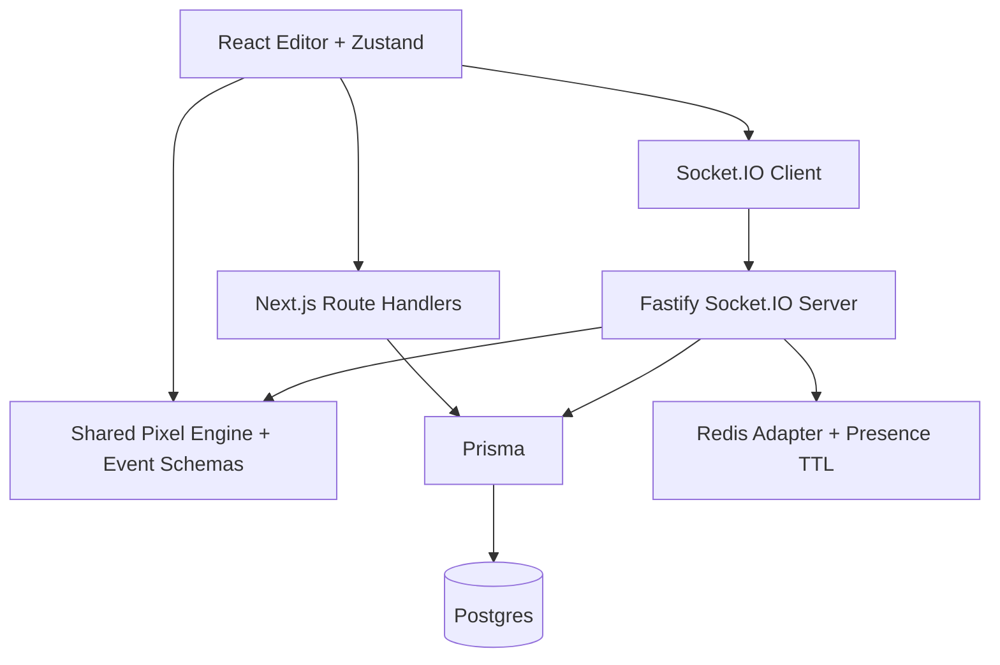

# Architecture

PixelSync uses a monorepo with a clear split between web UI, realtime collaboration, and shared contracts.

The web app owns product workflows: auth, dashboard, project/canvas creation, invites, versions, public viewer, and editor rendering. The realtime server owns volatile collaboration state: room membership, presence, cursor updates, operation ordering, dedupe, and persistence flushes.

The shared package prevents frontend/server drift by centralizing socket schemas, pixel encoding, drawing algorithms, permission helpers, and reconciliation logic.
